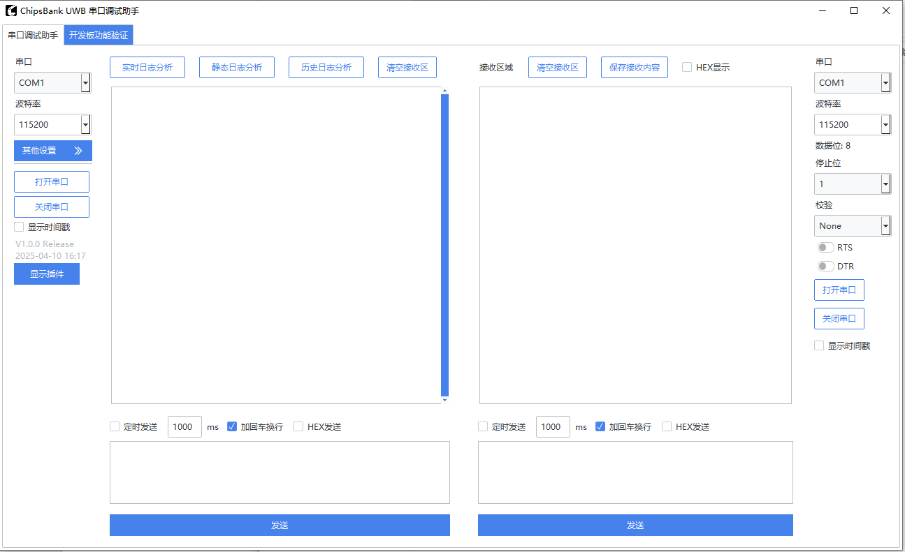

# Chipsbank Tool

## 概述
ChipsBank UWB 上位机软件是一款提供给工程师用于调试芯邦 UWB 芯片的综合性工具，软件核心功能包括串口调试、实时数据分析、日志分析、产测功能以及 OTA 升级等，为用户提供多种UWB 设备调试方法。

## 功能简介

**串口调试助手**
- 串口参数配置和开关控制
- 双串口收发窗口方便UWB收发两端测试
- 提供HEX格式，定时，加回车换行和显示时间戳等选项
- 提供日志保存和清除功能
- 提供UWB测试数据日志分析功能

**开发板功能验证**
- 升级功能，配合SDK的dfu_boot例程，可以实现固件升级
- 工厂模式，提供产测模式下的指令功能

## 使用步骤
    1. 安装python3.6以上版本
    2. 安装python 依赖库，双击运行 installer.bat
    3. 运行软件，双击运行 run_tools.bat

## 软件界面

